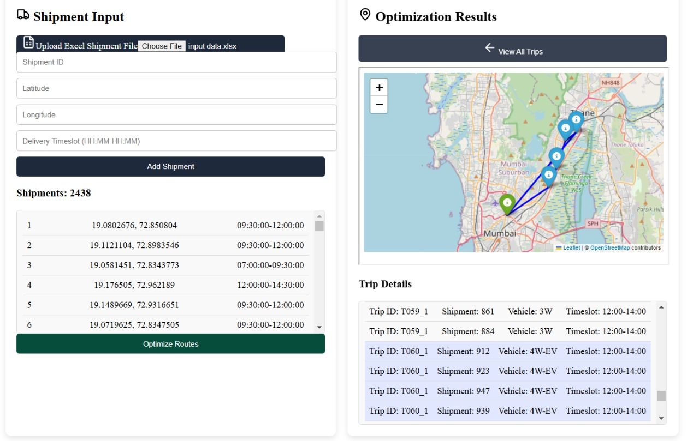

# SmartRoute Optimizer: Algorithm Design & Methodology

## Team ML Mavericks

**Neel Shah, Sneh Shah, Niral Shekhat**

## Core Algorithm Design

### Distance Calculation System

The foundation of the routing system is built on accurate geographical distance calculations using the Haversine formula. This mathematical approach accounts for Earth's spherical shape when calculating distances between two points given their latitude and longitude coordinates. The formula provides precise distance measurements in kilometers, making it particularly suitable for urban delivery scenarios where accuracy is crucial.

### Minimum Spanning Tree (MST) Approach

The system employs a Minimum Spanning Tree algorithm as its primary method for assessing route feasibility and estimating total distance. This approach:

- Constructs a graph where:
  - Vertices represent delivery points and the store location
  - Edges represent distances between points
  - Edge weights are calculated using the Haversine formula
- Uses an optimized Union-Find data structure to:
  - Track connected components efficiently
  - Implement path compression for better performance
  - Maintain the minimum distance spanning all points

### Vehicle Packing Strategy

The system implements a sophisticated approach to packing deliveries into vehicle routes:

- **Utilization Targets:**
  - Primary target: 90% of vehicle capacity
  - Minimum threshold: 70% of capacity
  - Dynamic adjustment based on remaining deliveries
- **Route Construction:**
  - Begins with strategic seed points (typically farthest deliveries)
  - Expands routes using nearest neighbor approach
  - Continuously validates multiple constraints
  - Adapts to vehicle-specific limitations

### Multi-Constraint Optimization

The algorithm simultaneously handles multiple operational constraints:

- **Time Constraints:**
  - Delivery window compliance
  - Travel time estimation (5 minutes per kilometer)
  - Delivery time allocation (10 minutes per stop)
  - Total route duration limits
- **Vehicle Constraints:**
  - Three vehicle types with different capacities
  - Maximum radius limitations
  - Priority vehicle utilization
  - Fleet size restrictions

### Route Construction Methodology

- **Initial Phase:**
  - Groups deliveries by time slot
  - Identifies strategic starting points
  - Evaluates multiple potential routes
- **Route Building:**
  - Begins with farthest points
  - Incrementally adds nearest neighbors
  - Maintains efficiency constraints
  - Validates vehicle capabilities
- **Optimization Metrics:**
  - Capacity utilization tracking
  - Time window compliance
  - Coverage area optimization
  - Vehicle type suitability

### Time Slot Management

- **Organization:**
  - Deliveries grouped by time windows
  - Independent optimization per slot
  - Parallel processing capability
- **Constraints:**
  - Strict delivery window compliance
  - Buffer time allocation
  - Vehicle availability consideration

### Performance Optimization

- **Algorithmic Efficiency:**
  - Path compression in graph operations
  - Early constraint violation detection
  - Optimized distance calculations
- **Resource Utilization:**
  - Priority-based vehicle allocation
  - Dynamic capacity adjustment
  - Efficient route expansion

### Metrics and Analysis

- **Route Metrics:**
  - Distance optimization
  - Time utilization
  - Vehicle capacity usage
  - Coverage efficiency
- **Performance Indicators:**
  - Trip completion rates
  - Vehicle utilization rates
  - Time slot adherence
  - Distance optimization

### Advanced Features

1. **Adaptive Route Planning**
   - Dynamic adjustment to vehicle allocation
   - Real-time constraint evaluation
   - Flexible capacity management
2. **Priority-Based Optimization**
   - Preference for eco-friendly vehicles
   - Efficient resource utilization
   - Balanced workload distribution
3. **Performance Monitoring**
   - Comprehensive metric tracking
   - Utilization analysis
   - Efficiency assessment

### Future Enhancement Possibilities

1. **Machine Learning Integration**
   - Demand prediction capabilities
   - Traffic pattern analysis
   - Dynamic time estimation
2. **Advanced Optimization Techniques**
   - Genetic algorithm implementation
   - Real-time route adjustment
   - Multi-objective optimization

This algorithm design demonstrates a sophisticated approach to solving the complex problem of delivery route optimization. It balances multiple competing constraints while maintaining efficiency and practical applicability. The system's modular design allows for future enhancements and adaptations to changing business needs.

The success of this approach lies in its ability to:

- Handle real-world constraints effectively
- Optimize multiple objectives simultaneously
- Maintain computational efficiency
- Provide practical, implementable solutions
- Adapt to varying operational conditions

This methodology provides a robust foundation for delivery route optimization while remaining flexible enough to accommodate future improvements and adaptations.
